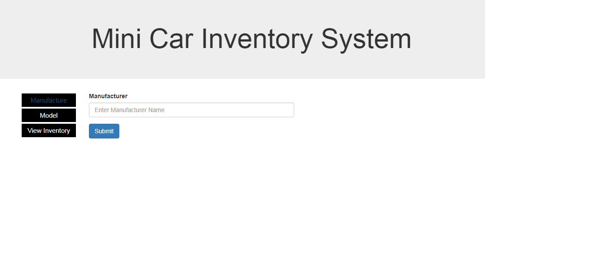
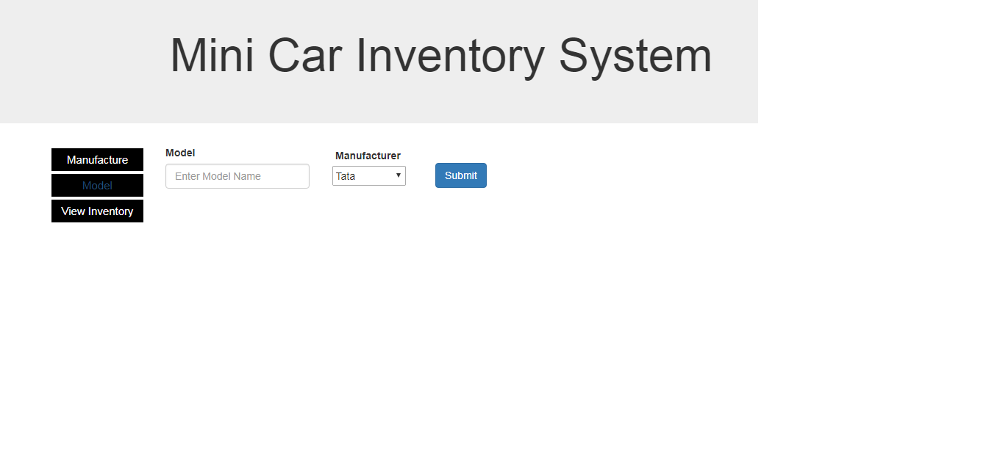
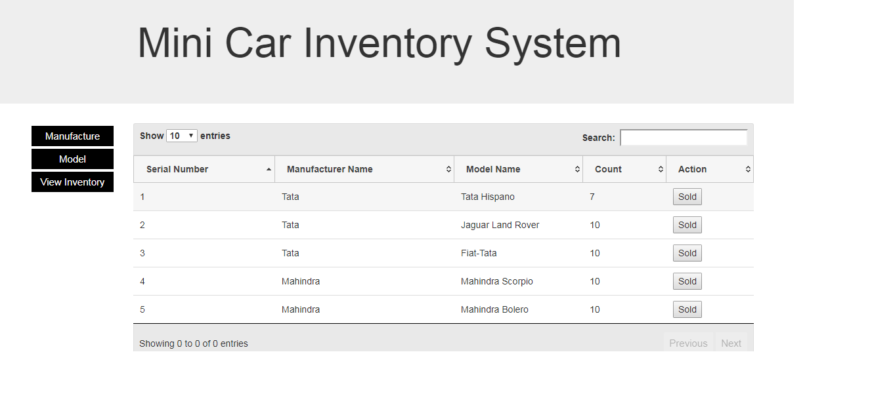

# carinventory
carinventory project source code
<html>
  <head></head>
  <body>
  <h1>Demo of Car Inventory</h1>
  <h3>Manufacturer</h3>
  
  
  <h3>Car Model</h3>
  
  
  <h3>View Inventory</h3>
  
  </body>
  </html>
